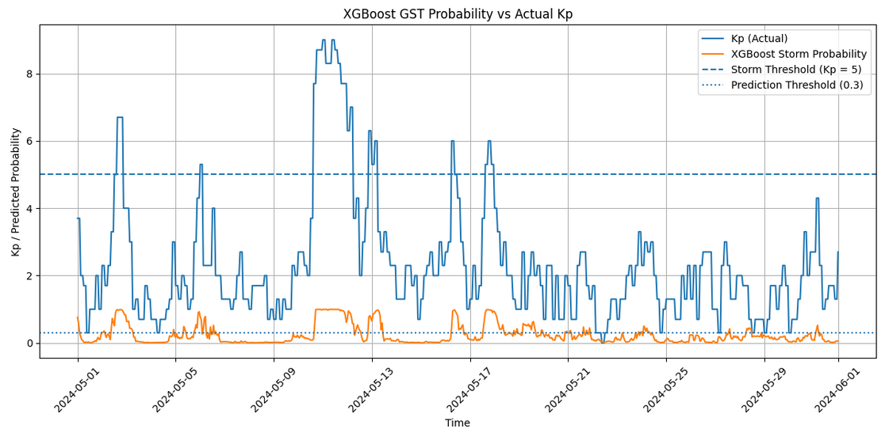
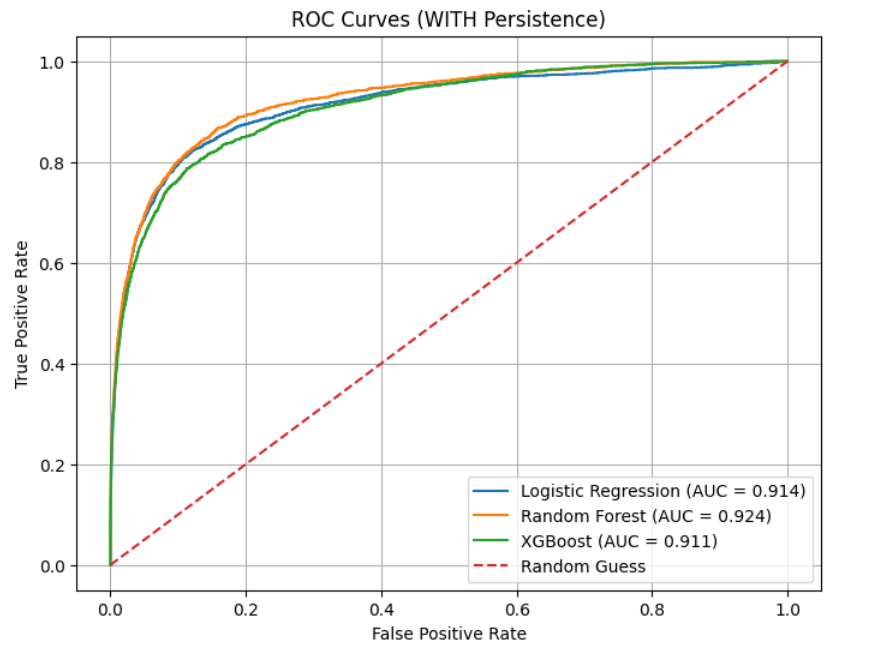
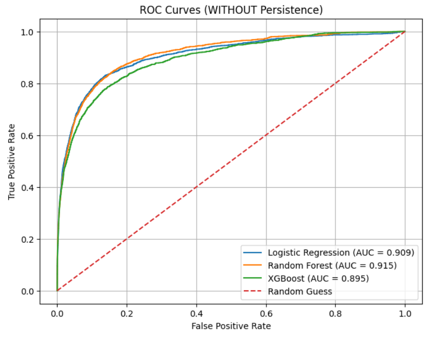
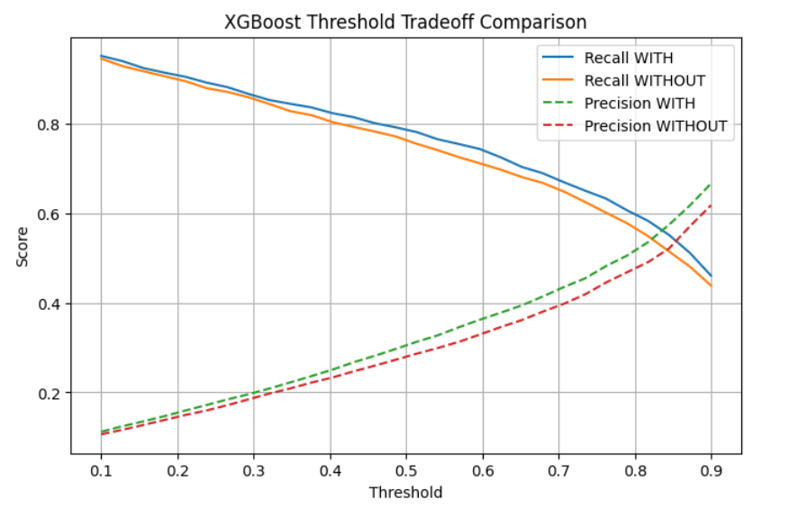
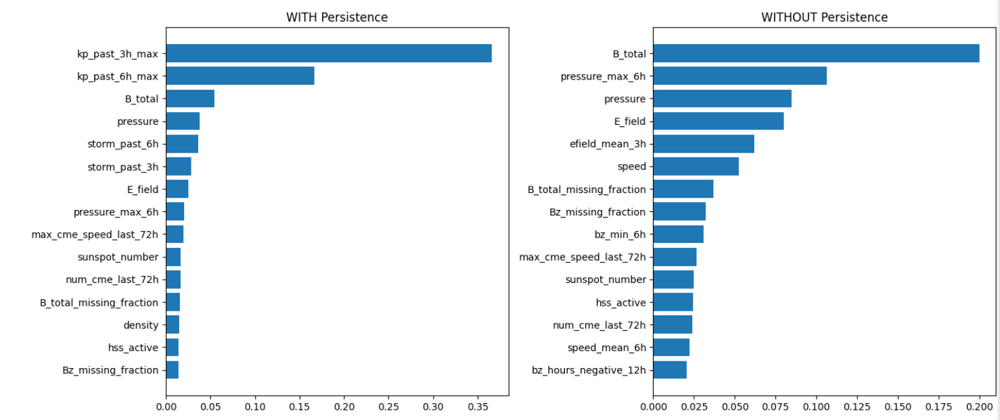

# Kaggle-style Data-Driven Framework for Geomagnetic Storm Prediction
This project presents a data-driven framework for predicting geomagnetic storm (GST) activity using machine learning techniques through a master dataset spanning 16 years in an attempt to identify and map important features and patterns within solar events preceding geomagnetic storms on a continuous time scale to complement geomagnetically induced current (GIC) models.

## Overview
The original inspiration for this project is defined by a pre-existing Kaggle dataset that provided a means to understand space weather through various datasets including properties for solar flares, coronal mass ejection (CME) events, and high-speed streams (HSS) retrieved from the NASA DONKI API, NOAA Space Weather Prediction Center, and NASA’s Solar Cycle Science websites [1].

This project will similarly retrieve multiple data sources from reputable sources in attempt to understand important features within GSTs. The approach within this repository formulates the problem of predicting GSTs as a binary classification task and predicts whether an event with Kp-index values ≥ 5 will occur within the next 6 hours using time-series features derived from solar wind conditions and adjacent solar activity such as CMEs and solar flares.

Multiple machine learning models (Logistic Regression, Random Forest, and XGBoost) are then trained on engineered hourly features, where temporal dependencies are handled using rolling windows and time-based splits to avoid data leakage. The best-performing model, XGBoost, achieved the strongest ROC-AUC performances (~0.89-0.92), with high recall at lower thresholds, enabling effective detection of storm conditions at the expense of precision.

## Summary of Work Done

## Data
### Data Sources
The sources of data are retrieved from NASA or NASA-adjacent sources.
-	NASA OMNI dataset [2]
-	NASA CCMC DONKI [3]
-	SIDC SILSO [4]

### Input Data
-	Solar Wind Data (hourly): north-south vertical component of interplanetary magnetic field (IMF; Bz), speed, density, pressure, electric field (OMNI)
-	Continuous Kp index (OMNI)
-	Geomagnetic storm Kp values (DONKI)
-	Coronal mass ejection events & associated speeds (DONKI)
-	Solar flare events (DONKI)
-	High-speed stream events (DONKI)
-	Average monthly sunspot count (SILSO)

### Output Data
-	Binary Label: storm_next_6h (1 if Kp ≥ 5 within next 6 hours)

### Dataset Size
-	Time range: ~2010-2026
-	Resolution: Hourly
-	Highly imbalanced (~3-6% GST events)

## Data Preprocessing / Clean-up
All datasets were first converted into a unified UTC datetime format to ensure temporal alignment. Several datasets, particularly OMNI solar wind measurements, contained sentinel values (e.g., 99999.9) representing missing or invalid data due to instrument errors. These values were replaced with NaN to correctly represent missing data. This same standardization for a uniform dataset was applied for other values such as the continuous Kp value needing to be scaled properly or the monthly sunspot count needing to be scaled hourly instead. 

Rather than simply discarding missing values, the preprocessing step preserved missingness information by generating indicator variables and fractional missingness metrics during hourly resampling. This allows the model to recognize periods of incomplete or unreliable data, which may themselves be associated with geomagnetic disturbances or measurement limitations.

For small, isolated gaps in the data, interpolation was applied to maintain continuity in time-series features. Larger gaps were left as missing and handled during model preprocessing (e.g., imputation), ensuring that artificially reconstructed data did not distort the underlying physical signals.

### Data Visualization

Sample interval from May to June for 2025 visualizing actual Kp-indexes with the selected model for the project with threshold values indicating the cutoff for a GST to be confirmed.

### Feature Engineering
Vectorized rolling windows were used to calculate event-based features to improve efficiency in analysis. 72-hour intervals are used to account for the time GST takes to arrive to Earth. Sunspot data is used as a proxy for the Sun’s solar cycle.

Solar wind features include:
-	Rolling averages, minima, and changes within Bz

Event-based features include:
-	Number of CMEs within the last 72 hours
-	Number of flares within the last 24 hours
-	Number of HSS events within the last 72 hours

Sunspot features include:
-	Monthly values mapped to hourly data

Persistence features include:
-	Events from the time a GST had already occurred

## Problem Formulation
Input:
-	Engineered numerical features from solar wind, solar activity, and geomagnetic history

Output:
-	Binary classification: Storm within next 6 hours

Models Used:
-	Logistic Regression
-	Random Forest
-	XGBoost

Logistic Regression is initially used due to its simplicity and to establish a baseline performance model to compare to more complex models. Random Forest is used to capture nonlinear relationships and interactions between features that may not be captured by linear models. XGBoost is used as the primary model due to its stronger performance on structured data and its ability to model complex nonlinear relationships while handling class imbalance effectively.

## Training
All training and coding are done through the IPython kernel within Jupyter Notebook. 
A time-based split method was used to prevent leakage. The trained data is based on pre-2019 data. The interval for validation includes data from 2019 to 2021. Then, tested data is based on 2022 and beyond.

Due to the imbalance of GSTs events occurring compared to the number of events where GSTs don’t occur, the project handles class imbalance by using class weighting (scale_pos_weight) in XGBoost.
Initially, a loop was used for target computation as well as computation of values for engineered features. Because of this, executing code took a very long time, especially with the amount of data that needed to be processed and modeled. To fix this problem, the project would later instead use vectorized computation to speed up processes.

Also, although the project includes persistence features for the models to train on, it was uncertain whether the models training off persistence features would analyze the underlying data for GSTs for prediction or instead become a persistence model instead. To account for this, persistence features are explicitly labeled with model performance being evaluated with and without persistence features.

## Performance Comparison
Metric used include:
-	ROC-AUC
-	Precision
-	Recall
-	F1-Score

### Model Performance (With Persistence, Test Set)
| Model           | Threshold | ROC-AUC | Precision | Recall | F1 Score |
|----------------|----------|--------|----------|--------|----------|
| Logistic Reg   | 0.3      | 0.914  | 0.14     | 0.93   | 0.24     |
| Logistic Reg   | 0.8      | 0.914  | 0.38     | 0.75   | 0.51     |
| Random Forest  | 0.3      | 0.924  | 0.19     | 0.92   | 0.31     |
| Random Forest  | 0.8      | 0.924  | 0.62     | 0.55   | 0.58     |
| XGBoost        | 0.3      | 0.911  | 0.20     | 0.86   | 0.32     |
| XGBoost        | 0.8      | 0.911  | 0.52     | 0.60   | 0.56     |

### Model Performance (Without Persistence, Test Set)
| Model           | Threshold | ROC-AUC | Precision | Recall | F1 Score |
|----------------|----------|--------|----------|--------|----------|
| Logistic Reg   | 0.3      | 0.909  | 0.12     | 0.94   | 0.22     |
| Logistic Reg   | 0.8      | 0.909  | 0.35     | 0.77   | 0.48     |
| Random Forest  | 0.3      | 0.915  | 0.17     | 0.91   | 0.29     |
| Random Forest  | 0.8      | 0.915  | 0.58     | 0.49   | 0.53     |
| XGBoost        | 0.3      | 0.895  | 0.19     | 0.86   | 0.31     |
| XGBoost        | 0.8      | 0.895  | 0.48     | 0.57   | 0.52     |

The ROC curves show that all models achieve strong discrimination between storm and non-storm conditions, with AUC values around 0.90 or higher. Random Forest achieves the highest AUC, suggesting that nonlinear relationships between features play an important role in storm prediction.

Through the validation set built on the time-split, a decision threshold for predictions was applied to convert probabilities into binary predictions. However, due to the context of GST prediction, multiple thresholds were evaluated to analyze the trade-off between precision and recall, with lower thresholds favoring higher recall and higher thresholds favoring higher precision. Having multiple thresholds allows the model to be adapted for different operational goals in mind.

All in all, XGBoost achieved the best overall performance. Higher recall is achieved at lower thresholds (~0.30) However, precision remains low due to the class imbalance and borderline geomagnetic activity conditions (Kp-index values of ~4). 

## Conclusions

Machine learning models can effectively predict geomagnetic storms within short time horizons with XGBoost performing the best. Overall, without persistence, the total magnetic field, solar wind pressure, and electric field seem to be the most important features in predicting GSTs. With persistence however, the most important features are the Kp-index values within the past 3 or 6 hours, meaning modeling with persistence be analyzing persistence instead of the underlying data. There is a clear trade-off between detecting storms (recall) and avoiding false alarms (precision). Many predicted events correspond to developing or borderline conditions, not all of which reach storm thresholds.

## Future Work
Additional complex physical modeling such as magnetosphere coupling could be incorporated to improve performance of the models. Alternative ways to handle class imbalance may lead to better performance. The work within this project is made in mind to complement geomagnetically induced current (GIC) modeling, making any resulting GIC model include an upstream prediction model rather than relying purely on downstream data.

# How to Reproduce Results
## Overview of Files in Repository
- Kaggle_DataProcessing.ipynb: Loads, cleans, and merges all datasets into a master hourly dataset
- Kaggle_Model&Analysis.ipynb: Trains models, evaluates performance, and generates plots

## Software Setup
Python packages used within the repository include:
-	Pandas
-	Json
-	Csv
-	NumPy
-	Matplotlib
-	Scikit-learn
-	XGBoost

XGBoost may be installed through running “pip install xgboost” within the terminal

## Data
The data may be downloaded through these links:
-	NASA OMNI dataset [2] (https://omniweb.gsfc.nasa.gov/form/dx1.html) 
-	NASA CCMC DONKI [3] (https://kauai.ccmc.gsfc.nasa.gov/DONKI/search/)
  - Datasets must be downloaded as a .json file 
-	SIDC SILSO [4] (https://www.sidc.be/SILSO/datafiles) 
  - Dataset must be downloaded as a .csv file

Place these files within your working directory:
-	"CMEAnalysis.json"
-	"FLR.json"
-	"GST.json"
-	"HSS.json"
-	"OMNI_5min_20100405_20140219.lst"
-	"OMNI_5min_20140220_20180318.lst"
-	"OMNI_5min_20180319_20220114.lst"
-	"OMNI_5min_20220115_20260331.lst"
-	“OMNI_1hr_Kp_20100405_20260331.lst”
-	"SILSO_SN_m_tot_V2.0.csv"

To finalize data processing, run: Kaggle_DataProcessing.ipynb

## Training & Performance Evaluation
To train the model, run: “Kaggle_Model&Analysis.ipynb”

This will also generate evaluation metrics, producing ROC and precision-recall curves for interpretation through tables and plots. 

## Citations
[1] https://www.kaggle.com/datasets/edacelikeloglu/nasa-space-weather-data

[2] King, J.H. and N.E. Papitashvili, Solar wind spatial scales in and comparisons of hourly Wind and ACE plasma and magnetic field data, J. Geophys. Res., 110, A02104, 2005. https://dx.doi.org/10.1029/2004JA010649

[3] https://kauai.ccmc.gsfc.nasa.gov/DONKI/

[4] Sunspot data from the World Data Center SILSO, Royal Observatory of Belgium, Brussels, https://doi.org/10.24414/qnza-ac80
